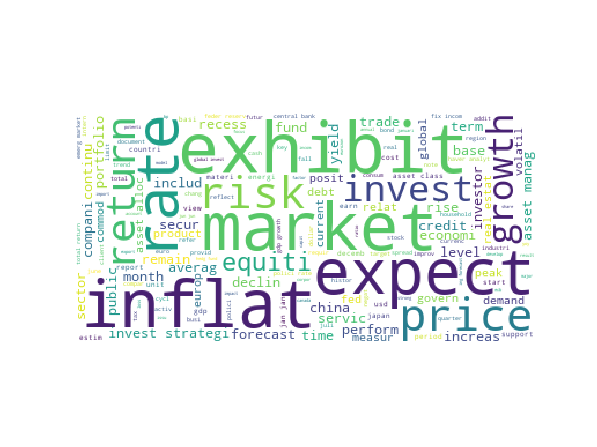

# financial_nlp_nlu
Given the quick pace of decision-making by investors, creditors, and lenders in the shifting landscape of financial markets, it is crucial to stay informed. Among the several tactics offered by analysts, one key practice for comprehending the complexities of the financial industry stands out: studying the detail included in financial reports produced by big financial organizations such as J.P.Morgan and Goldman Sachs.

The primary aim of this project is to facilitate financial reports analyses, with a focus on expediting information extraction and enabling pretty fast and clear visualization. A goal-oriented and fast information extraction process from important financial reports can be a game changer and enable much wiser and more strategic decisions in the financial domain.

### Dependencies
Install the required Python packages:
```python
pip -r requirements.txt
```

## Database
In order to be able to compare our gained insight with what really happened in the financial market and also be working with recent data we opted for 17 financial reports published in the 1st semester of 2023 which are: 
- Goldman Sachs_Caution Heavy Fog
- Unicredit_Economics chartbook Q2
- bnp_parisbas global view 2023
- UBS_alternative-investments-improving-portfolio-performance
- Goldman Sachs_global view 2023
- kkr_global view 2023
- Moodys_Weekly-Market-Outlook
- CACIB_-Monde-Hebdo
- Erste_Week Ahead
- ScotiaBank_global week ahead
- Commerz_European Sunrise
- ING_FX Talking July22
- jpmorgan_asset management Q1 2023
- _Goldman Sachs_global outlook
- jpmorgan_private banking global view 2023
- Goldman Sachs_exemple analyse macro economique goldman sachs
- Goldman Sachs_recession
- 
### Test Extraction
For this particular scenario, OCR proved to be time-consuming, and it struggled notably with multi-column text layouts and irregular text orientations, both of which are commonly found in financial reports. For that I chose to use PyMuPDF also known as Fitz which is a flexible python library offering advanced bunch of functionalities to deal with pdf documents including fast text and image extraction with consideration of internal document structure, access to metadata and perform text search.

### Text cleaning
Considering that inconsistent noisy data, such as variations in spelling, punctuation, formatting, irrelevant symbols and special characters can potentially confuse various models and lead to poor results, I consider the text cleaning step pivotal for the success of this project.
The preprocess_text function in our script will :
- Eliminate different regular expressions like: links, special characters, repeted letters like 'aaa' 'cc' and single characters.
- Use the manaually created dictionary, with the most popular unsignificant words used in such reports, to eliminate such vocaulary from the text.
- Remove punctuation.
- Remove numbers (Will only be used for visualization text but numbers will be encluded in the other functions).
- Remove stop words based on the text detected language using the 'detect' function of the 'langdetect' library.
- Stemming using SnowballStemmer.
- Lemmatization using WordNetLemmatizer.
- 
### Dataframe Creation
Minding the first business objective of this project which aims to separate legal pages from financial ones each record in our dataset will represent a page having as features:  page_num, text, clean_text, tokens, 
date, bank, title
 * page_num: The page number within the report.
 * text: The raw text content of the page.
 * title: The title of the report.
 * clean_text: The preprocessed and cleaned text.
 * tokens: The tokenized version of the text.
 * date: The date associated with the report.
 * bank: The bank or financial institution who have published the report.
### Data visualization
I will try to gain valuable insights from our extracted, cleaned text using WordCloud with the number of words as a hyperparameter and bar plots to visualize the most frequent words and n-grams.
To generate the needed visualizations into the EDA_output folder you need to run
```bash 
python main.py text_analysis
```


Besides to gain insights into the relationships between words and understand data clusters I will perform dientionality reduction using t-distributed Stochastic Neighbor Embedding (t-SNE).

### Data labeling

To train an effective model capable of distinguishing between legal and financial text, I needed a labelled training dataset. To achieve this, we employed LDA topic modelling, which effectively separated the text into two 
distinct topics: Topic 0, characterized by financial terminology, and Topic 1, primarily composed of legal terminology or neutral statements not related to financial domain.

#### Model training
The XGClassifier, with grid search to find the optimal hyperparameters and ROC curve next to F1_score for evaluation, was used to perform the classification task.

Feature -> data_class['clean_text']: Converted clean text documents to a matrix of token counts using CountVectorizer() from the scikit-learn library.

Target -> data_class['topic']: Legal or Financial topic
